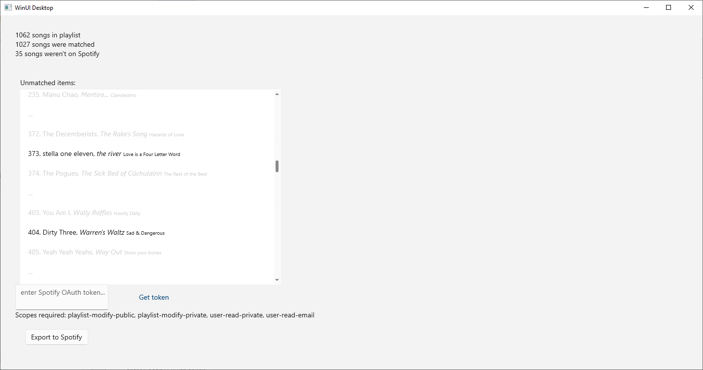

# OfflineToSpotify

WinUI application to convert a local playlist of songs to a Spotify playlist. Tries to automatically find matches based on metadata, and also supports manually supplying the correct match, or marking the song as unavailable on Spotify. Currently lacking such niceties as proper authentication (you pass it a token from Spotify's dev console) or much in the way of error handling.

 

---

 

